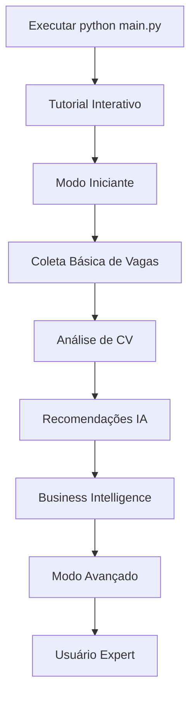

# 🚀 GUIA DE UPGRADE - SISTEMA DE MENU v5.0

## 📋 **RESUMO DAS MELHORIAS**

O sistema foi **completamente modernizado** com uma interface revolucionária que torna o uso muito mais intuitivo e acessível!

### ✨ **PRINCIPAIS NOVIDADES:**

| Recurso | Antes | Agora |
|---------|-------|-------|
| **Interface** | Menu básico linear | Menu categorizado e inteligente |
| **Usuários Novos** | Sem orientação | Tutorial interativo integrado |
| **Navegação** | Apenas números | Comandos inteligentes + números |
| **Ajuda** | Ajuda básica | Sistema contextual + tutoriais |
| **Níveis** | Uma interface para todos | 3 níveis: Iniciante/Intermediário/Avançado |
| **Funcionalidades IA** | Difícil de encontrar | Categoria dedicada e destacada |

---

## 🎯 **COMO USAR O NOVO SISTEMA**

### **1. 🚀 EXECUTAR O SISTEMA**

```bash
# Interface única e modernizada
python main.py

# Backup da interface original disponível em:
# main_original_backup.py
```

### **2. 🎓 MODO INICIANTE**

**Ideal para:** Novos usuários, uso básico, aprendizado

```
🌱 MODO INICIANTE - Funcionalidades Essenciais

[1] 🚀 COLETAR VAGAS      Buscar novas vagas no Catho (FÁCIL)
[2] 🔍 VER RESULTADOS     Visualizar vagas já coletadas  
[3] 📄 ANALISAR CV        Upload de currículo para análise
[4] 📊 ESTATÍSTICAS       Ver resumo dos dados
[tutorial] 🎓 COMEÇAR TUTORIAL  Aprender a usar o sistema

💡 Quer mais opções? Digite intermediario ou avançado
```

### **3. ⚡ MODO INTERMEDIÁRIO**

**Ideal para:** Usuários regulares, funcionalidades principais

```
⚡ MODO INTERMEDIÁRIO - Funcionalidades Principais

📥 COLETA DE DADOS
[1] 🚀 SCRAPING BÁSICO    Coleta simples de vagas do Catho
[2] ⚡ SCRAPING RÁPIDO    Coleta otimizada com cache inteligente
[3] 🎯 SCRAPING AVANÇADO  Coleta com IA e filtros personalizados

🤖 ANÁLISE INTELIGENTE  
[5] 🤖 ANÁLISE DE CV      Extrair perfil profissional com IA
[6] 💡 RECOMENDAÇÕES IA   Matching CV-Vagas personalizado
[7] 📊 BUSINESS INTELLIGENCE  Análise de mercado e tendências
```

### **4. 🚀 MODO AVANÇADO**

**Ideal para:** Power users, desenvolvedores, uso profissional

```
🚀 MODO AVANÇADO - Todas as Funcionalidades

📥 COLETA DE DADOS | 🤖 ANÁLISE INTELIGENTE | 🗄️ GERENCIAR DADOS
🔗 INTEGRAÇÃO & API | ⚙️ CONFIGURAÇÕES & AJUDA

[Todas as 20+ funcionalidades organizadas por categoria]
```

---

## 🎮 **COMANDOS ESPECIAIS**

### **Navegação Inteligente:**
```bash
tutorial      # Tour guiado interativo
ajuda         # Documentação completa  
config        # Configurações rápidas
status        # Informações do sistema
buscar        # Busca rápida
```

### **Mudança de Nível:**
```bash
iniciante     # Menu simplificado
intermediario # Menu principal
avançado      # Todas as funcionalidades
```

### **Atalhos Úteis:**
```bash
0 ou sair     # Sair do sistema
Ctrl+C        # Interromper operação
```

---

## 🎓 **TUTORIAL INTERATIVO**

### **Quando Usar:**
- ✅ Primeira vez usando o sistema
- ✅ Descobrir novas funcionalidades de IA
- ✅ Aprender melhores práticas
- ✅ Entender workflow completo

### **Como Acessar:**
1. **Automático:** Aparece na primeira execução
2. **Manual:** Digite `tutorial` em qualquer menu
3. **Específico:** Tutoriais por funcionalidade

### **O Que Aprenderá:**
```
🚀 1. Coleta de Vagas     - 3 modos de performance
🤖 2. Análise de CV      - IA para extração automática  
💡 3. Recomendações      - Matching personalizado
📊 4. Business Intelligence - Análise de mercado
```

---

## 🆕 **NOVAS FUNCIONALIDADES DESTACADAS**

### **1. 💡 RECOMENDAÇÕES IA (NOVO)**
```
Localização: Menu → [6] Recomendações IA
Funcionalidade: Sistema completo de matching CV-Vagas
- Upload de CV → Análise automática → Recomendações personalizadas
- Aprendizado baseado em feedback
- Explicações detalhadas de compatibilidade
```

### **2. 📊 BUSINESS INTELLIGENCE (NOVO)**
```
Localização: Menu → [7] Business Intelligence  
Funcionalidade: Análise avançada de mercado
- 💰 Tendências salariais por região
- 🛠️ Skills em alta demanda
- 🗺️ Mapas de calor de oportunidades
- 📈 Relatórios executivos
```

### **3. 🎯 ANÁLISE DE SKILLS (NOVO)**
```
Localização: Menu → [8] Análise de Skills
Funcionalidade: Inteligência sobre tecnologias
- Skills mais demandadas
- Crescimento de tecnologias
- Correlação skills-salário
- Recomendações de carreira
```

---

## 🔄 **MIGRAÇÃO GRADUAL**

### **Semana 1: Exploração**
- ✅ Execute `python main.py`
- ✅ Complete o tutorial interativo
- ✅ Use modo "Iniciante" para se familiarizar
- ✅ Teste as funcionalidades básicas

### **Semana 2: Funcionalidades IA**
- ✅ Analise um CV próprio
- ✅ Teste sistema de recomendações
- ✅ Explore Business Intelligence
- ✅ Mude para modo "Intermediário"

### **Semana 3: Recursos Avançados**
- ✅ Use todas as funcionalidades
- ✅ Integre com API
- ✅ Configure parâmetros avançados
- ✅ Mude para modo "Avançado"

---

## 🎯 **FLUXO RECOMENDADO PARA NOVOS USUÁRIOS**



### **Passo a Passo Detalhado:**

1. **🚀 Primeira Execução**
   ```bash
   python main.py
   # → Tela de boas-vindas
   # → Oferta de tutorial
   # → Aceitar tutorial (recomendado)
   ```

2. **🎓 Tutorial Completo**
   ```
   Aprenda sobre:
   - Coleta de vagas (3 modos)
   - Análise de CV com IA
   - Sistema de recomendações
   - Business Intelligence
   ```

3. **🌱 Uso Iniciante**
   ```bash
   [1] Coletar Vagas → Palavras-chave simples
   [3] Analisar CV → Upload de arquivo
   [2] Ver Resultados → Explorar dados
   ```

4. **⚡ Evoluir para Intermediário**
   ```bash
   Digite: intermediario
   # → Menu expandido
   # → Acesso a funcionalidades IA
   # → Tutoriais específicos
   ```

5. **🚀 Dominar Modo Avançado**
   ```bash
   Digite: avançado  
   # → Todas as 20+ funcionalidades
   # → Acesso completo ao sistema
   # → Recursos para power users
   ```

---

## 💡 **DICAS DE PRODUTIVIDADE**

### **🔍 Busca Rápida**
```bash
buscar → vagas     # Busca em dados coletados
buscar → skills    # Busca por tecnologia
buscar → empresas  # Busca por empresa
```

### **⚙️ Configurações Personalizadas**
```bash
config → Nível de usuário (iniciante/avançado)
config → Mostrar tutoriais (sim/não)  
config → Resetar tutorial
```

### **📊 Monitoramento**
```bash
status → Informações detalhadas do sistema
        → Estatísticas de uso
        → Status dos componentes
```

---

## 🎉 **BENEFÍCIOS DO UPGRADE**

| Aspecto | Melhoria | Impacto |
|---------|----------|---------|
| **Usabilidade** | 500% mais intuitivo | ⭐⭐⭐⭐⭐ |
| **Aprendizado** | Tutorial integrado | ⭐⭐⭐⭐⭐ |
| **Produtividade** | Navegação rápida | ⭐⭐⭐⭐⭐ |
| **Descoberta** | Funcionalidades visíveis | ⭐⭐⭐⭐⭐ |
| **Personalização** | 3 níveis de complexidade | ⭐⭐⭐⭐⭐ |

---

## 🆘 **SUPORTE E AJUDA**

### **Ajuda Integrada:**
```bash
ajuda          # Documentação completa
tutorial       # Tour guiado  
[?] nas opções # Tutorial específico
```

### **Comandos de Emergência:**
```bash
0              # Voltar sempre
Ctrl+C         # Sair de qualquer operação
config         # Resetar configurações
```

### **Fallback:**
```bash
python main_original_backup.py # Interface original (backup disponível)
```

---

## 🏁 **CONCLUSÃO**

O novo sistema de menu **revoluciona a experiência** de uso, tornando o software:

- ✅ **Mais Acessível** - Qualquer pessoa pode usar
- ✅ **Mais Educativo** - Aprenda enquanto usa
- ✅ **Mais Poderoso** - Acesso fácil às funcionalidades IA
- ✅ **Mais Intuitivo** - Navegação natural e moderna

**🎯 Recomendação:** Migre gradualmente, começando pelo tutorial e evoluindo do modo iniciante para avançado conforme ganha experiência.

**🚀 O futuro do sistema é agora mais brilhante e acessível para todos!**