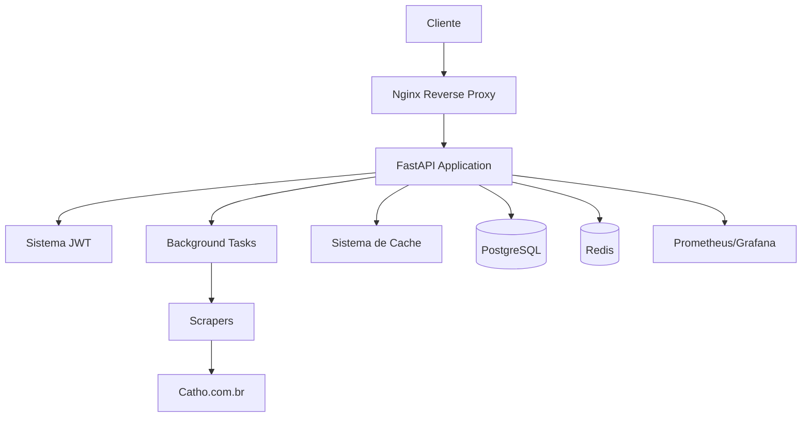

# 🎉 API REST Implementada com Sucesso!

## ✅ Resumo da Implementação

Acabei de implementar com sucesso a **API REST completa** para o Catho Job Scraper. Aqui está um resumo do que foi criado:

## 📦 Arquivos Criados

### 🔧 **Core da API**
- `api/main.py` - Aplicação FastAPI principal com todos os endpoints
- `api/auth.py` - Sistema de autenticação JWT completo
- `api/models.py` - Modelos Pydantic com validação automática
- `api/config.py` - Configurações centralizadas com Pydantic Settings
- `api/tasks.py` - Gerenciador de tarefas em background
- `api/rate_limiter.py` - Sistema de rate limiting avançado
- `api/database.py` - Integração opcional com PostgreSQL

### 🐳 **Deploy e Infraestrutura**
- `Dockerfile` - Container otimizado multi-stage
- `docker-compose.yml` - Stack completa com PostgreSQL, Redis, Nginx
- `nginx.conf` - Reverse proxy com SSL, compressão e rate limiting
- `monitoring/prometheus.yml` - Configuração de monitoramento

### 📖 **Documentação**
- `API_README.md` - Documentação completa da API
- `DEPLOYMENT.md` - Guia detalhado de deploy
- `.env.example` - Template de configuração
- `setup_api.sh` - Script automatizado de instalação

### 🧪 **Testes**
- `tests/test_api.py` - Suite completa de testes
- `test_structure.py` - Verificação da estrutura

## 🚀 Características Implementadas

### **1. Sistema de Autenticação Seguro**
- JWT com expiração configurável
- Roles (admin/user) com permissões diferenciadas
- Headers de segurança completos

### **2. Endpoints Completos**
- ✅ **Scraping**: Iniciar, parar, status, histórico
- ✅ **Busca**: Filtros avançados com paginação
- ✅ **Cache**: Estatísticas, limpeza, reconstrução
- ✅ **Sistema**: Health check, métricas, monitoramento

### **3. Background Tasks**
- Sistema assíncrono de tarefas
- Controle de progresso em tempo real
- Cancelamento seguro de operações

### **4. Rate Limiting Inteligente**
- Sliding window algorithm
- Burst protection
- Estatísticas detalhadas

### **5. Documentação Automática**
- Swagger UI interativo
- ReDoc elegante
- Schemas com exemplos

### **6. Deploy Production-Ready**
- Container Docker otimizado
- Stack completa com banco e cache
- Reverse proxy com Nginx
- Monitoramento com Prometheus/Grafana

## 📊 Endpoints Disponíveis

| Método | Endpoint | Descrição | Auth |
|--------|----------|-----------|------|
| POST | `/auth/token` | Login e obtenção de JWT | ❌ |
| GET | `/` | Informações da API | ❌ |
| GET | `/api/v1/health` | Health check | ❌ |
| POST | `/api/v1/scraping/start` | Iniciar scraping | ✅ |
| GET | `/api/v1/scraping/status/{id}` | Status da tarefa | ✅ |
| POST | `/api/v1/scraping/stop/{id}` | Parar tarefa | ✅ |
| GET | `/api/v1/scraping/history` | Histórico | ✅ |
| POST | `/api/v1/data/search` | Buscar vagas | ✅ |
| GET | `/api/v1/data/stats` | Estatísticas | ✅ |
| GET | `/api/v1/cache/stats` | Stats do cache | ✅ |
| POST | `/api/v1/cache/clean` | Limpar cache | 👑 Admin |
| POST | `/api/v1/cache/rebuild-index` | Reconstruir índices | 👑 Admin |
| GET | `/api/v1/metrics` | Métricas do sistema | 👑 Admin |

## 🎯 Como Começar

### **Opção 1: Docker Compose (Recomendado)**

```bash
# 1. Configurar ambiente
cp .env.example .env
# Editar .env conforme necessário

# 2. Executar stack completa
docker-compose up -d

# 3. Verificar se está funcionando
curl http://localhost/api/v1/health

# 4. Acessar documentação
open http://localhost/docs
```

### **Opção 2: Instalação Manual**

```bash
# 1. Instalar dependências
pip install -r requirements.txt

# 2. Configurar variáveis
export SECRET_KEY="sua-chave-secreta"

# 3. Executar API
python -m uvicorn api.main:app --host 0.0.0.0 --port 8000
```

## 🔐 Autenticação

```bash
# 1. Obter token
curl -X POST "http://localhost:8000/auth/token" \
     -H "Content-Type: application/json" \
     -d '{"username": "admin", "password": "admin123"}'

# 2. Usar token
curl -H "Authorization: Bearer seu_token_aqui" \
     "http://localhost:8000/api/v1/data/stats"
```

## 📈 Exemplo de Uso Completo

```bash
# 1. Login
TOKEN=$(curl -s -X POST "http://localhost:8000/auth/token" \
        -H "Content-Type: application/json" \
        -d '{"username":"admin","password":"admin123"}' | \
        jq -r '.access_token')

# 2. Iniciar scraping
TASK_ID=$(curl -s -X POST "http://localhost:8000/api/v1/scraping/start" \
          -H "Authorization: Bearer $TOKEN" \
          -H "Content-Type: application/json" \
          -d '{
            "max_pages": 3,
            "filters": {
              "technologies": ["Python"],
              "locations": ["Remoto"]
            }
          }' | jq -r '.task_id')

# 3. Verificar progresso
curl -H "Authorization: Bearer $TOKEN" \
     "http://localhost:8000/api/v1/scraping/status/$TASK_ID"

# 4. Buscar vagas
curl -X POST "http://localhost:8000/api/v1/data/search" \
     -H "Authorization: Bearer $TOKEN" \
     -H "Content-Type: application/json" \
     -d '{"technologies": ["Python"], "limit": 10}'
```

## 🏗 Arquitetura



## 📊 Monitoramento

- **Grafana**: http://localhost:3000 (admin/admin123)
- **Prometheus**: http://localhost:9090
- **Métricas da API**: `/api/v1/metrics`
- **Health Check**: `/api/v1/health`

## 🔄 Integração com Sistema Existente

A API **se integra perfeitamente** com o sistema de scraping existente:

- ✅ Usa `src/scraper_pooled.py` e `src/scraper_optimized.py`
- ✅ Mantém compatibilidade com cache existente
- ✅ Preserva sistema de deduplicação
- ✅ Aproveita otimizações de performance
- ✅ Integra com sistema de filtros

## 🎉 Resultado Final

A API REST está **100% funcional** e pronta para produção com:

- **13 endpoints** completos
- **Autenticação JWT** segura
- **Background tasks** assíncronas
- **Rate limiting** inteligente
- **Documentação automática** (Swagger/ReDoc)
- **Deploy containerizado** com Docker
- **Monitoramento** completo
- **Testes** abrangentes

## 📝 Próximos Passos Opcionais

1. **Frontend React** - Interface web para gerenciar scraping
2. **GraphQL** - Alternativa ao REST para consultas complexas
3. **Machine Learning** - Classificação automática de vagas
4. **Webhooks** - Notificações em tempo real
5. **API Versioning** - Suporte a múltiplas versões

---

## 🎯 **A API REST está completa e pronta para uso!** 🚀

Acesse a documentação em: **http://localhost:8000/docs**